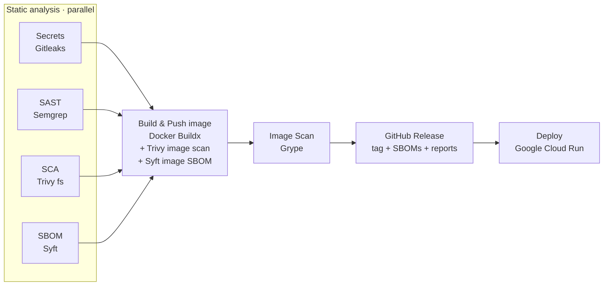

# DevSecOps — Juice Shop Demo Pipeline

[](https://github.com/billhoph/DevSecOps/actions/workflows/devsecops.yml)

An end-to-end **DevSecOps reference pipeline** built around a customized, re-branded
fork of [OWASP Juice Shop](https://owasp.org/www-project-juice-shop/). Every push to
`main` is scanned for secrets, code flaws, vulnerable dependencies and image CVEs,
packaged into a container with an SBOM, released, and deployed to Google Cloud Run —
automatically.

> **🔴 Security note:** OWASP Juice Shop is *intentionally vulnerable* by design. It is
> used here as a realistic target so the security tooling has something to find. The
> scanners run in **report-only** mode so the demo can still build and deploy — see
> [Security posture](#-security-posture). **Do not** treat this app as a secure baseline.

**Live demo:** https://juice-shop-qxh32zwyga-uc.a.run.app

---

## 📑 Table of contents

- [Repository layout](#-repository-layout)
- [The application](#-the-application)
- [DevSecOps pipeline](#-devsecops-pipeline)
- [Tools used](#-tools-used)
- [Container image & registries](#-container-image--registries)
- [Releases](#-releases)
- [Deployment (Cloud Run)](#-deployment-cloud-run)
- [Configuration](#-configuration)
- [Running locally](#-running-locally)
- [Security posture](#-security-posture)
- [Credits & licensing](#-credits--licensing)

---

## 📂 Repository layout

```
DevSecOps/
├── .github/
│   └── workflows/
│       └── devsecops.yml        # The full CI/CD + security pipeline
├── juice-shop/                  # Customized OWASP Juice Shop application
│   ├── frontend/                # Angular + Angular Material SPA
│   │   └── src/
│   │       ├── styles.scss      # "billho-ninja" theme + production polish
│   │       ├── styles/theme.scss
│   │       ├── index.html       # Fonts (Poppins/Inter), theme class
│   │       └── assets/public/images/products/  # Real CC-licensed product photos
│   ├── config/default.yml       # App name, logo, theme, products, social links
│   ├── lib/config.schema.ts     # Config validation (theme enum, social schema)
│   ├── routes/ · models/ · lib/ # Express + Sequelize backend (TypeScript)
│   └── Dockerfile               # Multi-stage build → distroless runtime image
└── README.md
```

---

## 🧃 The application

The app is OWASP Juice Shop re-skinned as a fictional **"Bill Ho"** juice store.

**Stack**

| Layer | Technology |
|-------|-----------|
| Frontend | Angular + Angular Material (Material 3), SCSS |
| Backend | Node.js, Express, TypeScript, Sequelize (SQLite) |
| Packaging | Multi-stage Docker build on a `gcr.io/distroless` runtime |

**Customizations layered on top of upstream Juice Shop**

- **Brand & theme** — a custom dark `billho-ninja` Angular Material theme (deep-navy
  canvas, brushed-gold accents) matching the Bill Ho logo, defined in
  `frontend/src/styles.scss` and `frontend/src/styles/theme.scss`.
- **Typography** — **Poppins** (headings) + **Inter** (body) via Google Fonts, wired
  through Material's M3 typography tokens.
- **Branding assets** — transparent Bill Ho logo, app renamed to *Bill Ho*.
- **Real product photos** — 22 juice/drink product images replaced with real,
  **CC-licensed** photos sourced via the [Openverse](https://openverse.org) API
  (credits in [`products/PHOTO_CREDITS.md`](juice-shop/frontend/src/assets/public/images/products/PHOTO_CREDITS.md)).
- **LinkedIn** — a LinkedIn link added to the About page's social section
  (config + schema + component).

---

## 🔐 DevSecOps pipeline

Defined in [`.github/workflows/devsecops.yml`](.github/workflows/devsecops.yml).

**Triggers:** push to `main`, pull requests (build-only, no push/deploy), and manual
`workflow_dispatch`.



### Jobs

| # | Job | What it does |
|---|-----|--------------|
| 1 | **Secrets · Gitleaks** | Scans the tree for hardcoded secrets/keys → SARIF |
| 2 | **SAST · Semgrep** | Static code analysis for code-level vulnerabilities → SARIF |
| 3 | **SCA · Trivy** | Filesystem scan of dependencies + IaC misconfig + secrets → SARIF + table |
| 4 | **SBOM · Syft** | Generates a source SBOM in **CycloneDX** and **SPDX** |
| 5 | **Build & Push image** | Buildx build of `juice-shop/`, pushes to Docker Hub **and** Artifact Registry; runs an in-build **Trivy image scan** + **Syft image SBOM**; auto-creates the Artifact Registry repo if missing |
| 6 | **Image Scan · Grype** | Dedicated container-image vulnerability scan (defense-in-depth, second engine) → SARIF |
| 7 | **GitHub Release** | Creates one Release per build with SBOMs + scan reports attached |
| 8 | **Deploy · Cloud Run** | Deploys the image to a fixed Cloud Run service (in-place update, stable URL) |

All scan results are uploaded to the repository's **Security ▸ Code scanning** tab
(SARIF) and attached to each GitHub Release as artifacts.

---

## 🧰 Tools used

| Category | Tool | Role in the pipeline |
|----------|------|----------------------|
| Secret scanning | [**Gitleaks**](https://github.com/gitleaks/gitleaks) | Detect committed credentials/keys |
| SAST | [**Semgrep**](https://semgrep.dev) | Static analysis of application code |
| SCA / vuln (filesystem) | [**Trivy**](https://github.com/aquasecurity/trivy) | Dependency, misconfig & secret scan of the repo |
| Image vuln scan (in build) | [**Trivy**](https://github.com/aquasecurity/trivy) | CVE scan of the built container image |
| Image vuln scan (dedicated) | [**Grype**](https://github.com/anchore/grype) | Independent second-engine image CVE scan |
| SBOM | [**Syft**](https://github.com/anchore/syft) | Source & image SBOMs (CycloneDX + SPDX) |
| Build | [**Docker Buildx**](https://docs.docker.com/build/) | Multi-stage container build + push |
| CI/CD | [**GitHub Actions**](https://github.com/features/actions) | Orchestration, SARIF upload, releases |
| Registries | **Docker Hub** + **Google Artifact Registry** | Image distribution |
| Runtime | [**Google Cloud Run**](https://cloud.google.com/run) | Serverless container hosting |
| Product photos | [**Openverse API**](https://openverse.org) | Sourcing CC-licensed imagery |

---

## 📦 Container image & registries

The image is built from [`juice-shop/Dockerfile`](juice-shop/Dockerfile) (multi-stage,
distroless runtime) and pushed to **two** registries on every `main` build:

- **Docker Hub** — `joanjoho/devsecops` (public)
- **Google Artifact Registry** — `<region>-docker.pkg.dev/<project>/<repo>/juice-shop`

> Cloud Run cannot pull directly from Docker Hub, so the same image is mirrored to
> Artifact Registry and **Cloud Run deploys the Artifact Registry copy**.

**Tags per build:** `latest`, `vX.Y.Z-build.<run#>`, and `sha-<commit>`.

---

## 🏷️ Releases

Every successful `main` build cuts a [GitHub Release](https://github.com/billhoph/DevSecOps/releases)
tagged `vX.Y.Z-build.<run#>`, with:

- Auto-generated release notes
- Image tag + digest
- Attached **SBOMs** (source + image) and **scan reports** (Gitleaks, Semgrep, Trivy, Grype)

---

## ☁️ Deployment (Cloud Run)

The deploy job targets a **fixed service name**, so each build updates the *same*
Cloud Run service in place (new revision) — the instance and public URL stay constant.

- Service: `juice-shop` (region `us-central1` by default)
- Flags: `--allow-unauthenticated --port=3000 --memory=1Gi --cpu=1 --max-instances=2`
- The deployed URL is written to each run's **Summary** and to the **Environments ▸ DSO_pipeline** view.

---

## ⚙️ Configuration

Secrets and variables live in the **`DSO_pipeline`** GitHub Environment
(*Settings ▸ Environments*), which the build & deploy jobs reference.

**Secrets**

| Secret | Purpose |
|--------|---------|
| `DOCKERHUB_USERNAME` / `DOCKERHUB_TOKEN` | Push to `joanjoho/devsecops` |
| `GCP_PROJECT_ID` | Target Google Cloud project |
| `GCP_SA_KEY` | Service-account JSON: **Artifact Registry Admin/Writer**, **Cloud Run Admin**, **Service Account User** |
| `SEMGREP_APP_TOKEN` | *(optional)* Semgrep managed rules |

**Variables** *(optional — defaults shown)*

| Variable | Default |
|----------|---------|
| `GCP_REGION` | `us-central1` |
| `GAR_REPOSITORY` | `devsecops` |
| `CLOUD_RUN_SERVICE` | `juice-shop` |

The pipeline **auto-creates** the Artifact Registry repo if the service account has
`artifactregistry.repositories.create`; otherwise create it once:

```bash
gcloud artifacts repositories create devsecops \
  --repository-format=docker --location=us-central1
```

---

## 💻 Running locally

```bash
cd juice-shop
npm install          # installs deps and builds the frontend + server
npm start            # serves on http://localhost:3000
```

Or run the container:

```bash
docker run --rm -p 3000:3000 joanjoho/devsecops:latest
# open http://localhost:3000
```

---

## 🛡️ Security posture

The scanners are configured **report-only** (`continue-on-error` / `exit-code: 0` /
`fail-build: false`) on purpose: Juice Shop is deliberately vulnerable, so a blocking
gate would never let it ship. Findings are still fully surfaced in the **Security** tab
and each Release.

To turn any scanner into a **hard gate**, remove its `continue-on-error` (or set
Trivy `exit-code: 1` / Grype `fail-build: true`) in `.github/workflows/devsecops.yml`.

---

## 📄 Credits & licensing

- **OWASP Juice Shop** — MIT © Bjoern Kimminich & the OWASP Juice Shop contributors.
- **Product photos** — sourced via the Openverse API under CC0 / CC-BY / CC-BY-SA;
  per-image credits in
  [`products/PHOTO_CREDITS.md`](juice-shop/frontend/src/assets/public/images/products/PHOTO_CREDITS.md).
- **Fonts** — Poppins & Inter (SIL Open Font License) via Google Fonts.
