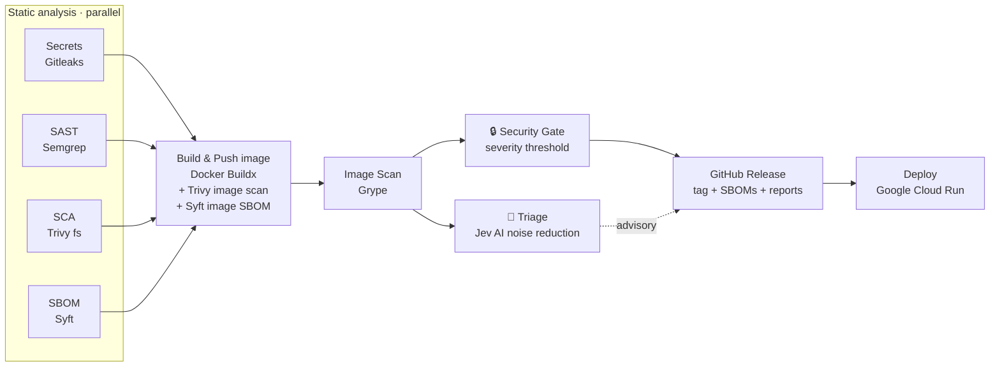

# DevSecOps — Juice Shop Demo Pipeline

[](https://github.com/billhoph/DevSecOps/actions/workflows/devsecops.yml)

An end-to-end **DevSecOps reference pipeline** built around a customized, re-branded
fork of [OWASP Juice Shop](https://owasp.org/www-project-juice-shop/). Every push to
`main` is scanned for secrets, code flaws, vulnerable dependencies and image CVEs,
**AI-triaged to cut noise** (Jev), gated on a configurable severity threshold,
packaged into a container with an SBOM, released, and deployed to Google Cloud Run —
automatically.

> **🔴 Security note:** OWASP Juice Shop is *intentionally vulnerable* by design. It is
> used here as a realistic target so the security tooling has something to find. The
> scanners run in **report-only** mode so the demo can still build and deploy — see
> [Security posture](#-security-posture). **Do not** treat this app as a secure baseline.

**Live demo:** https://juice-shop-qxh32zwyga-uc.a.run.app

---

## 📑 Table of contents

- [Repository layout](#-repository-layout)
- [The application](#-the-application)
- [DevSecOps pipeline](#-devsecops-pipeline)
- [AI triage with Jev](#-ai-triage-with-jev)
- [Security gate](#-security-gate)
- [Tools used](#-tools-used)
- [Container image & registries](#-container-image--registries)
- [Releases](#-releases)
- [Deployment (Cloud Run)](#-deployment-cloud-run)
- [Configuration](#-configuration)
- [Running locally](#-running-locally)
- [Security posture](#-security-posture)
- [Credits & licensing](#-credits--licensing)

---

## 📂 Repository layout

```
DevSecOps/
├── .github/
│   ├── workflows/
│   │   └── devsecops.yml        # The full CI/CD + security pipeline
│   └── scripts/
│       ├── sarif_summary.py     # SARIF → Markdown tables + aggregate + gate
│       └── jev_triage.py        # Jev AI triage / noise reduction
├── juice-shop/                  # Customized OWASP Juice Shop application
│   ├── frontend/                # Angular + Angular Material SPA
│   │   └── src/
│   │       ├── styles.scss      # Storefront design system (dark + light themes)
│   │       ├── styles/theme.scss
│   │       ├── index.html       # Fonts, theme-init (dark/light), theme class
│   │       ├── app/navbar/      # Navbar incl. theme toggle + language picker
│   │       └── assets/public/images/products/  # Real CC-licensed product photos
│   ├── config/default.yml       # App name, logo, theme, products, social links
│   ├── lib/config.schema.ts     # Config validation (theme enum, social schema)
│   ├── routes/ · models/ · lib/ # Express + Sequelize backend (TypeScript)
│   └── Dockerfile               # Multi-stage build → distroless runtime image
└── README.md
```

---

## 🧃 The application

The app is OWASP Juice Shop re-skinned as a fictional **"Bill Ho"** juice store.

**Stack**

| Layer | Technology |
|-------|-----------|
| Frontend | Angular + Angular Material (Material 3), SCSS |
| Backend | Node.js, Express, TypeScript, Sequelize (SQLite) |
| Packaging | Multi-stage Docker build on a `gcr.io/distroless` runtime |

**Customizations layered on top of upstream Juice Shop**

- **Production storefront redesign** — neutral canvas with orange/amber as a
  restrained accent, refined type scale, tasteful radii and solid CTAs
  (`frontend/src/styles.scss`, `styles/theme.scss`).
- **Dark / light theme** — full light **and** dark Material surface sets switched via
  `html[data-theme]`; a navbar sun/moon toggle persists to `localStorage`, and an
  inline `index.html` script applies the saved/system scheme before first paint.
- **Typography** — **Plus Jakarta Sans** (display) + **Inter** (text/UI) via Google
  Fonts, wired through Material's M3 typography tokens.
- **Multi-language** — Juice Shop's built-in i18n (**43 locales**) with a searchable
  language picker in the navbar.
- **Branding assets** — transparent Bill Ho logo, app renamed to *Bill Ho*.
- **Real product photos** — 22 juice/drink product images replaced with real,
  **CC-licensed** photos sourced via the [Openverse](https://openverse.org) API
  (credits in [`products/PHOTO_CREDITS.md`](juice-shop/frontend/src/assets/public/images/products/PHOTO_CREDITS.md)).
- **LinkedIn** — a LinkedIn link added to the About page's social section
  (config + schema + component).

---

## 🔐 DevSecOps pipeline

Defined in [`.github/workflows/devsecops.yml`](.github/workflows/devsecops.yml).

**Triggers:** push to `main`, pull requests (build-only, no push/deploy), and manual
`workflow_dispatch`.


```mermaid
flowchart LR
  subgraph Scan [Static analysis · parallel]
    A[Secrets<br/>Gitleaks]
    B[SAST<br/>Semgrep]
    C[SCA<br/>Trivy fs]
    D[SBOM<br/>Syft]
  end
  A --> E
  B --> E
  C --> E
  D --> E
  E[Build &amp; Push image<br/>Docker Buildx<br/>+ Trivy image scan<br/>+ Syft image SBOM]
  E --> F[Image Scan<br/>Grype]
  F --> T[🧠 Triage<br/>Jev AI noise reduction]
  F --> J[🔒 Security Gate<br/>severity threshold]
  J --> G[GitHub Release<br/>tag + SBOMs + reports]
  G --> H[Deploy<br/>Google Cloud Run]
  T -.advisory.-> G
```

### Jobs

| # | Job | What it does |
|---|-----|--------------|
| 1 | **Secrets · Gitleaks** | Scans the tree for hardcoded secrets/keys → SARIF |
| 2 | **SAST · Semgrep** | Static code analysis for code-level vulnerabilities → SARIF |
| 3 | **SCA · Trivy** | Filesystem scan of dependencies + IaC misconfig + secrets → SARIF + table |
| 4 | **SBOM · Syft** | Generates a source SBOM in **CycloneDX** and **SPDX** |
| 5 | **Build & Push image** | Buildx build of `juice-shop/`, pushes to Docker Hub **and** Artifact Registry; runs an in-build **Trivy image scan** + **Syft image SBOM**; auto-creates the Artifact Registry repo if missing |
| 6 | **Image Scan · Grype** | Dedicated container-image vulnerability scan (defense-in-depth, second engine) → SARIF |
| 7 | **🧠 Triage · Jev** | **AI noise reduction** — turns all findings into a prioritized P1–P4 action list and collapses low-value noise (advisory, non-blocking). See [AI triage with Jev](#-ai-triage-with-jev) |
| 8 | **🔒 Security Gate** | Optional severity threshold (`none`/`CRITICAL`/`HIGH`/`MEDIUM`) in `warn` or `enforce` mode. See [Security gate](#-security-gate) |
| 9 | **GitHub Release** | Creates one Release per build with the aggregate summary + SBOMs + scan reports attached |
| 10 | **Deploy · Cloud Run** | Deploys the image to a fixed Cloud Run service (in-place update, stable URL) |

All scan results are uploaded to the repository's **Security ▸ Code scanning** tab
(SARIF) and attached to each GitHub Release as artifacts, and each run's **Summary**
page shows per-stage findings tables plus an aggregate severity table.

---

## 🧠 AI triage with Jev

A non-blocking **`Triage · Jev`** job ([`.github/scripts/jev_triage.py`](.github/scripts/jev_triage.py))
uses [**Jev** (TypeSafe AI "System One")](https://aimlapi.com/models/typesafe-jev-latest)
to cut **vulnerability noise** so operators act on the few findings that matter instead
of scrolling hundreds.

> **The problem it solves.** On this build the scanners emit **461 findings**. Severity
> alone doesn't help — a "critical" in a dev-only or unreachable dependency is noise,
> while a reachable "high" is urgent. Jev adds an **operational priority** layer on top
> of raw severity. Result this run: **461 → 270 actionable (P1+P2)**, with **61
> deprioritized as noise** and the rest bucketed to backlog/informational.

### Why Jev can help

Jev is **not a text LLM** — it's a *System-One* decision model that returns **typed,
confidence-scored answers** (not prose). Three properties make it a good noise-reduction
engine:

- **Structured, comparable output.** Every finding gets the same typed verdict +
  a confidence and a probability distribution — directly sortable/filterable, no parsing
  of free text, no hallucinated remediation steps.
- **Cheap & fast at scale.** ~70–500 ms per call and ~$0.042 / M input tokens (output
  free), so it's economical to score *every* finding on *every* build.
- **Confidence-aware.** Because each decision carries a probability, the pipeline can
  act only on **high-confidence** calls and leave uncertain ones visible — safe automation.

### How it reduces noise (mechanism)

For each finding Jev answers three typed questions over a compact state object:

| Question | Type | Purpose |
|---|---|---|
| `ops_priority` | `score` (ordered P4→P1) | operational fix priority (vs. raw severity) |
| `likely_noise` | `noul` (0–1 probability) | how likely it is low-value noise |
| `route` | `choice` | `fix` / `review` / `accept` / `duplicate` |

The job then:

1. **Deduplicates** findings by `(scanner, id, severity)` signature, so the same CVE
   repeated across many packages is decided **once** (254 → 150 unique signatures here) —
   fewer calls, consistent verdicts.
2. **Re-prioritizes** every finding into **P1–P4** using `ops_priority`.
3. **Collapses the long tail** — a Low/Medium finding is folded into "noise" only when
   `likely_noise` clears the confidence threshold; **Critical/High are never collapsed**.
4. **Emits a short action list** (P1/P2 first, with the `route` + confidence) to the run
   **Summary** page and a `report-jev-triage` artifact (`jev-triage.json`) for dashboards.

### Configuration leveraged to achieve it

The noise reduction is driven by explicit, tunable design choices — all in
[`jev_triage.py`](.github/scripts/jev_triage.py) and the `triage` job:

| Lever | Value / choice | Why it matters |
|---|---|---|
| **Typed question schema** | `score` with ordered `criteria` P4→P1, `noul`, `choice` | The *typed* contract is what makes Jev's output comparable and machine-actionable — the heart of the design |
| **Sanitized `state`** | only `scanner, id, severity, cvss, category, component` (regex-cleaned, truncated) | Keeps tokens tiny (cheap/fast) **and** resists Jev's known prompt-injection weakness — no finding text/code is ever sent |
| **Signature dedup** | key = `(scanner, id, severity)` | Collapses repeats; bounds API calls and gives one verdict per real issue |
| **`NOISE_CONF`** | `0.85` | Only high-confidence Low/Med findings are demoted — avoids hiding real issues |
| **Never-collapse rule** | `severity in {Critical, High}` | Safety floor: severe findings always stay in the action list |
| **`MAX_SIGNATURES`** | `150` (most-severe first) | Caps cost/time per run; overflow falls back to severity-based priority |
| **Concurrency** | `ThreadPoolExecutor(8)` | Scores hundreds of findings in seconds (job ran in ~12 s) |
| **`model` / auth** | `jev-latest`, `Authorization: Bearer ${{ secrets.JEV_API_KEY }}` | Key lives in the `DSO_pipeline` environment secret, never in code |
| **Advisory placement** | separate job, `continue-on-error: true`, not a dep of gate/deploy | Noise reduction never blocks or breaks the pipeline |

### Guardrails (why Jev is boxed in)

Jev is **advisory** — independent testing shows it's weak at *detecting* vulns and is
prompt-injection-prone, so the design deliberately constrains it:

- **Advisory only** — never suppresses findings (full SARIF still goes to the Security
  tab) and **never overrides the Security Gate**. The split is: scanners **find** → Jev
  **triages** → the deterministic gate **decides**.
- **Injection-resistant** — sanitized structured metadata only; never finding text/code.
- **Critical/High are never auto-collapsed.**

**Setup:** add a `JEV_API_KEY` secret to the `DSO_pipeline` environment (see
[Configuration](#-configuration)). If the key is absent, the job simply skips.

---

## 🔒 Security gate

An optional **`Security Gate`** job enforces a severity threshold. It is driven by
`workflow_dispatch` inputs so normal pushes stay report-only (the default):

- **`gate_severity`** — `none` · `CRITICAL` · `HIGH` · `MEDIUM` (fail at this level *and above*)
- **`gate_mode`** — `warn` (report, pipeline runs through) · `enforce` (**block**: fails
  the gate, skipping Release + Deploy)

Run it from **Actions ▸ DevSecOps CI/CD ▸ Run workflow** and pick a severity + mode.
The gate is deterministic (it counts SARIF findings via `sarif_summary.py gate`) — the
reliable half of the "scanners find → Jev triages → gate decides" split.

---

## 🧰 Tools used

| Category | Tool | Role in the pipeline |
|----------|------|----------------------|
| Secret scanning | [**Gitleaks**](https://github.com/gitleaks/gitleaks) | Detect committed credentials/keys |
| SAST | [**Semgrep**](https://semgrep.dev) | Static analysis of application code |
| SCA / vuln (filesystem) | [**Trivy**](https://github.com/aquasecurity/trivy) | Dependency, misconfig & secret scan of the repo |
| Image vuln scan (in build) | [**Trivy**](https://github.com/aquasecurity/trivy) | CVE scan of the built container image |
| Image vuln scan (dedicated) | [**Grype**](https://github.com/anchore/grype) | Independent second-engine image CVE scan |
| SBOM | [**Syft**](https://github.com/anchore/syft) | Source & image SBOMs (CycloneDX + SPDX) |
| AI triage | [**Jev** (TypeSafe System One)](https://aimlapi.com/models/typesafe-jev-latest) | Typed, confidence-scored decisions to prioritize findings & reduce noise |
| Build | [**Docker Buildx**](https://docs.docker.com/build/) | Multi-stage container build + push |
| CI/CD | [**GitHub Actions**](https://github.com/features/actions) | Orchestration, SARIF upload, releases |
| Registries | **Docker Hub** + **Google Artifact Registry** | Image distribution |
| Runtime | [**Google Cloud Run**](https://cloud.google.com/run) | Serverless container hosting |
| Product photos | [**Openverse API**](https://openverse.org) | Sourcing CC-licensed imagery |

---

## 📦 Container image & registries

The image is built from [`juice-shop/Dockerfile`](juice-shop/Dockerfile) (multi-stage,
distroless runtime) and pushed to **two** registries on every `main` build:

- **Docker Hub** — `joanjoho/devsecops` (public)
- **Google Artifact Registry** — `<region>-docker.pkg.dev/<project>/<repo>/juice-shop`

> Cloud Run cannot pull directly from Docker Hub, so the same image is mirrored to
> Artifact Registry and **Cloud Run deploys the Artifact Registry copy**.

**Tags per build:** `latest`, `vX.Y.Z-build.<run#>`, and `sha-<commit>`.

---

## 🏷️ Releases

Every successful `main` build cuts a [GitHub Release](https://github.com/billhoph/DevSecOps/releases)
tagged `vX.Y.Z-build.<run#>`, with:

- Auto-generated release notes + the **aggregate security summary table**
- Image tag + digest
- Attached **SBOMs** (source + image) and **scan reports** (Gitleaks, Semgrep, Trivy, Grype)

---

## ☁️ Deployment (Cloud Run)

The deploy job targets a **fixed service name**, so each build updates the *same*
Cloud Run service in place (new revision) — the instance and public URL stay constant.

- Service: `juice-shop` (region `us-central1` by default)
- Flags: `--allow-unauthenticated --port=3000 --memory=1Gi --cpu=1 --max-instances=2`
- The deployed URL is written to each run's **Summary** and to the **Environments ▸ DSO_pipeline** view.

---

## ⚙️ Configuration

Secrets and variables live in the **`DSO_pipeline`** GitHub Environment
(*Settings ▸ Environments*), which the build, triage & deploy jobs reference.

**Secrets**

| Secret | Purpose |
|--------|---------|
| `DOCKERHUB_USERNAME` / `DOCKERHUB_TOKEN` | Push to `joanjoho/devsecops` |
| `GCP_PROJECT_ID` | Target Google Cloud project |
| `GCP_SA_KEY` | Service-account JSON: **Artifact Registry Admin/Writer**, **Cloud Run Admin**, **Service Account User** |
| `JEV_API_KEY` | *(optional)* [Jev](https://api.typesafe.ai) API key for the AI triage job (job skips if absent) |
| `SEMGREP_APP_TOKEN` | *(optional)* Semgrep managed rules |

**Variables** *(optional — defaults shown)*

| Variable | Default |
|----------|---------|
| `GCP_REGION` | `us-central1` |
| `GAR_REPOSITORY` | `devsecops` |
| `CLOUD_RUN_SERVICE` | `juice-shop` |

The pipeline **auto-creates** the Artifact Registry repo if the service account has
`artifactregistry.repositories.create`; otherwise create it once:

```bash
gcloud artifacts repositories create devsecops \
  --repository-format=docker --location=us-central1
```

---

## 💻 Running locally

```bash
cd juice-shop
npm install          # installs deps and builds the frontend + server
npm start            # serves on http://localhost:3000
```

Or run the container:

```bash
docker run --rm -p 3000:3000 joanjoho/devsecops:latest
# open http://localhost:3000
```

---

## 🛡️ Security posture

The scanners are configured **report-only** (`continue-on-error` / `exit-code: 0` /
`fail-build: false`) on purpose: Juice Shop is deliberately vulnerable, so a blocking
gate would never let it ship. Findings are still fully surfaced in the **Security** tab
and each Release, **AI-triaged by Jev** into a prioritized action list, and can be
**blocked on demand** via the [Security Gate](#-security-gate) (`enforce` mode).

The split is deliberate: the **scanners find**, **Jev triages** (advisory — fast but
not trusted for blocking), and the **deterministic gate decides** (reliable). To turn an
individual scanner into a hard gate instead, remove its `continue-on-error` (or set
Trivy `exit-code: 1` / Grype `fail-build: true`) in `.github/workflows/devsecops.yml`.

---

## 📄 Credits & licensing

- **OWASP Juice Shop** — MIT © Bjoern Kimminich & the OWASP Juice Shop contributors.
- **Product photos** — sourced via the Openverse API under CC0 / CC-BY / CC-BY-SA;
  per-image credits in
  [`products/PHOTO_CREDITS.md`](juice-shop/frontend/src/assets/public/images/products/PHOTO_CREDITS.md).
- **Fonts** — Plus Jakarta Sans & Inter (SIL Open Font License) via Google Fonts.
